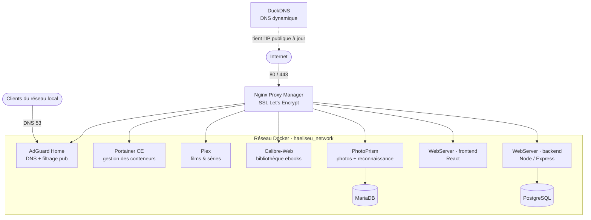

# Home-infrastructure

Les fichiers `docker-compose.yml` de mon homelab : tout ce que j'auto-héberge à la
maison, exposé en HTTPS derrière un reverse proxy, sur un nom de domaine maintenu à
jour par DNS dynamique.

Un dossier = un service = un `docker-compose.yml` autonome. Tous les conteneurs
publiés se rejoignent sur un réseau Docker externe commun, `haeliseu_network`, ce qui
permet au reverse proxy de les atteindre par leur nom de conteneur.

## Schéma des services



## Ce que j'auto-héberge

| Service                  | Image                              | Rôle                                                         | Sous-domaine                     |
| ------------------------ | ---------------------------------- | ------------------------------------------------------------ | -------------------------------- |
| **Nginx Proxy Manager**  | `jc21/nginx-proxy-manager`         | Reverse proxy, certificats Let's Encrypt automatiques        | `nginxproxymanager.arisalexia.fr` |
| **AdGuard Home**         | `adguard/adguardhome`              | Serveur DNS du réseau + blocage pub/traqueurs (DoT, DoH)     | `adguardhome.arisalexia.fr`      |
| **DuckDNS**              | `lscr.io/linuxserver/duckdns`      | DNS dynamique : suit l'IP publique de la ligne               | —                                |
| **Portainer CE**         | `portainer/portainer-ce`           | Interface de gestion Docker, déploiements et mises à jour    | `portainer.arisalexia.fr`        |
| **Plex**                 | `lscr.io/linuxserver/plex`         | Serveur média (films, séries)                                | `plex.arisalexia.fr`             |
| **PhotoPrism**           | `photoprism/photoprism` + MariaDB  | Photothèque avec indexation, visages et classification       | `photo.arisalexia.fr`            |
| **Calibre / Calibre-Web**| `lscr.io/linuxserver/calibre(-web)`| Bibliothèque et serveur d'ebooks                             | `library.arisalexia.fr`          |
| **WebServer**            | build local                        | Petite app maison : React en front, Node/Express + PostgreSQL en back, auth par contexte React | `webapp.` / `api.arisalexia.fr` |

## Stack

- **Docker & Docker Compose** — un `docker-compose.yml` par service, volumes montés
  sous `/srv/appdata/…` ou `/docker/…` selon le service
- **Réseau** : réseau Docker externe `haeliseu_network` partagé par tous les services
  exposés ; le reverse proxy est le seul à publier 80/443
- **TLS** : Let's Encrypt via Nginx Proxy Manager (renouvellement automatique)
- **DNS** : AdGuard Home en résolveur du LAN, DuckDNS pour l'accès depuis l'extérieur
- **App maison** : Node.js / Express + PostgreSQL (API) et React (front), images
  construites localement puis déployées depuis Portainer
- **Maintenance** : Dependabot + workflow GitHub Actions d'auto-merge pour garder les
  images et dépendances à jour

## Démarrage d'un service

Le réseau partagé doit exister une seule fois :

```bash
docker network create haeliseu_network
```

Ensuite, service par service :

```bash
cd NginxProxyManager      # ou Plex, Photoprism, Adguardhome…
docker compose up -d
docker compose logs -f
```

Le reverse proxy se configure ensuite depuis son interface (port `81`) : un *proxy
host* par sous-domaine, qui pointe vers le nom du conteneur et son port interne.

## Configuration

Les `docker-compose.yml` de ce dépôt sont mes fichiers de référence. Avant de les
réutiliser :

- adapter les chemins de volumes (`/srv/appdata`, `/docker`, `/path/to/...`) à la
  machine hôte ;
- ajuster `TZ`, `PUID` / `PGID` ;
- **sortir toute valeur sensible du YAML** (tokens DNS, mots de passe de bases,
  jetons de revendication) vers un fichier `.env` non versionné, référencé via
  `${VARIABLE}` dans le compose.
